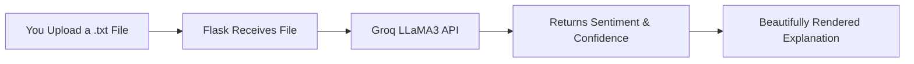

<h1 align="center">🧠✨ Sentiment Analyzer powered by Groq LLaMA3 🚀</h1>

  Upload a .txt file and get a real-time Sentiment Analysis Report using <b>Groq’s blazing-fast LLaMA3 model</b> 🔥

  
  
  

---

## 🔗 Live Demo

👉 [Try it Now](https://text-sentiment-analyzer-tau.vercel.app/) – Just upload a `.txt` file and get:
- 📊 **Sentiment** (Positive / Negative / Neutral)
- 🎯 **Confidence Score**
- 💬 **Detailed Explanation**

---

## 📸 Screenshot

> Uploading a `.txt` file & getting sentiment results instantly!
> 

---

## 🛠️ Tech Stack

| Frontend | Backend | Model | Hosting |
|----------|---------|-------|---------|
| 🧾 Jinja2 (HTML) | 🐍 Flask (Python) | 🧠 Groq LLaMA3 (via API) | ▲ Vercel |

---

## 💡 Features

✅ Upload `.txt` files directly  
✅ Uses the blazing fast **Groq API with LLaMA3**  
✅ Auto-analyzes tone, confidence & gives you a clear explanation  
✅ Elegant Flask UI with Jinja templates  

✅ Fully deployed on Vercel (Python Serverless App)

---

## 🚀 How It Works

## 📁 Folder Structure

sentiment-analyzer/
├── api/
│   └── index.py          ← Flask backend with Groq API call
├── templates/
│   └── index.html        ← Jinja2 frontend UI
├── requirements.txt      ← Flask, CORS, requests
├── vercel.json           ← Vercel config
└── README.md             ← This file 😉

## 🔒 Environment Variables
Create a .env file locally for testing:
GROQ_API_KEY=your-groq-api-key-here

## 🧪 Local Development

# Step 1: Clone the repo
git clone https://github.com/reddymeghna/Text-Sentiment-Analyzer.git
cd sentiment-analyzer

# Step 2: Create and activate a virtual environment
python -m venv venv
source venv/bin/activate  # on Windows: venv\Scripts\activate

# Step 3: Install dependencies
pip install -r requirements.txt

# Step 4: Run locally
python app.py

🤝 Let's Connect
Made with ❤️ by Meghna Reddy
